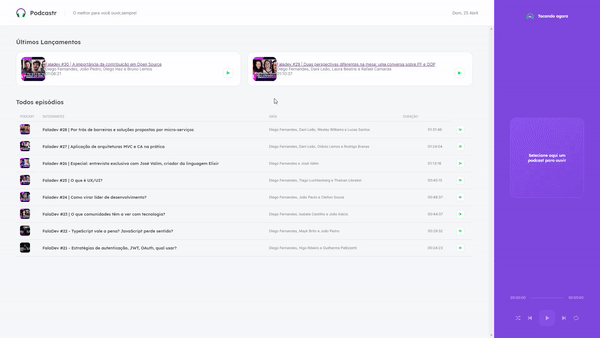

<div align="center">
  
  
</div>


## 💻 About the Project

Project developed during the 5th edition of the Next Level Week of Rocketseat using typescript, react.js and next.js. Podcastr is a platform built for podcast broadcasting. 

## 🧭 Tecnologies

This project was developed using:
- [Typescript](https://www.typescriptlang.org/)
- [ReactJS](https://reactjs.org/)
- [Next.js](https://nextjs.org/)

<h2>
  📌 To have a copy of the project
</h2>

### Clone the repository to have a copy of the code on your machine

```bash
$ git clone https://github.com/jvictorribeiro/Podcastr-NLW5.git && cd Podcastr-NLW5
```

### Get all dependencies

```bash
$ yarn install
```

### Run the 'backend' server

```bash
$ yarn server
```

### Run the project

```bash
$ yarn dev
```

The app will be available for access on your browser at **http://localhost:3000**

## 📝 Licença

This project is under the **MIT** license.

<h3 align=center>Made by <a href="https://www.linkedin.com/in/victor-ribeiroo//">Jv</a></h3>
